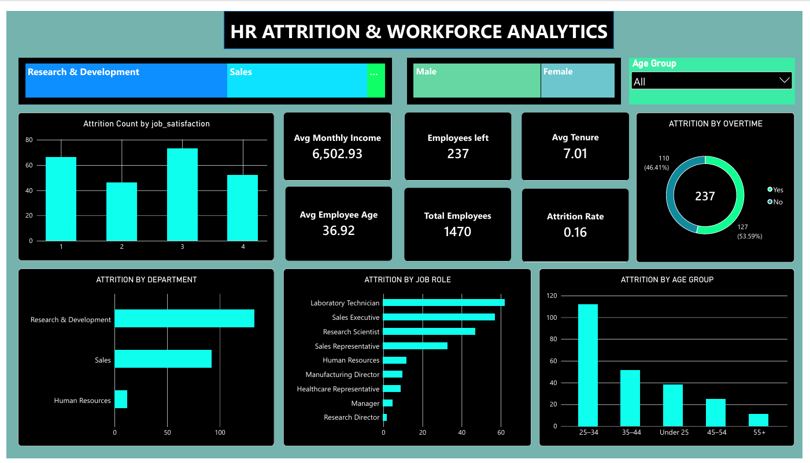

# HR-Attrition-Workforce-Analytics
End-to-end HR Attrition &amp; Workforce Analytics project using PostgreSQL, SQL, Python, Pandas, Matplotlib and Power BI.

## 📊 Power BI Dashboard Preview

<p align="center">
  
</p>

## 🎯 Project Overview

This project analyzes employee attrition and workforce patterns using SQL, Python and Power BI.

The objective is to identify important attrition patterns across:

- Departments
- Job Roles
- Age Groups
- Overtime
- Employee Tenure
- Monthly Income
- Job Satisfaction

The project follows a complete data analytics workflow from raw data to business insights.

---

## 📌 Key Dashboard KPIs

| KPI | Value |
|---|---:|
| 👥 Total Employees | **1,470** |
| 🚪 Employees Left | **237** |
| 📉 Attrition Rate | **16%** |
| 💰 Avg Monthly Income | **6,502.93** |
| ⏳ Avg Tenure | **7.01 Years** |
| 🎂 Avg Employee Age | **36.92 Years** |


## 🎛️ Power BI Dashboard Features

The interactive dashboard provides analysis of:

- Attrition by Department
- Attrition by Job Role
- Attrition by Age Group
- Attrition by Overtime
- Job Satisfaction
- Workforce KPIs

### Interactive Filters

Users can filter the dashboard by:

- Department
- Gender
- Age Group

# 🎯 Business Objective

The main objectives of this project are:

- Measure overall employee attrition.
- Identify departments with higher attrition.
- Analyze the relationship between overtime and attrition.
- Analyze attrition across employee income levels.
- Understand attrition based on employee tenure.
- Identify job roles with higher attrition.
- Analyze attrition across age groups.
- Identify high-risk employee segments.
- Build an interactive HR dashboard.
- Generate actionable workforce insights.

# 📂 Dataset

**Dataset:** IBM HR Analytics Employee Attrition Dataset

The dataset contains employee-level information including:

- Employee demographics
- Department
- Job role
- Monthly income
- Age
- Overtime
- Years at company
- Job satisfaction
- Attrition status
- Other employee-related attributes

**Total Employees:** 1,470

# 🛠️ Tools & Technologies

| Tool | Purpose |
|---|---|
| PostgreSQL | Database management |
| SQL | Data analysis |
| Python | Exploratory data analysis |
| Pandas | Data manipulation |
| Matplotlib | Data visualization |
| Power BI | Interactive dashboard |
| GitHub | Portfolio & documentation |

---

# 🔄 Project Workflow

```text
Raw HR Dataset
       ↓
Data Preparation
       ↓
PostgreSQL
       ↓
SQL Analysis
       ↓
Python + Pandas
       ↓
Matplotlib Visualizations
       ↓
Power BI Dashboard
       ↓
Business Insights
       ↓
GitHub Portfolio


